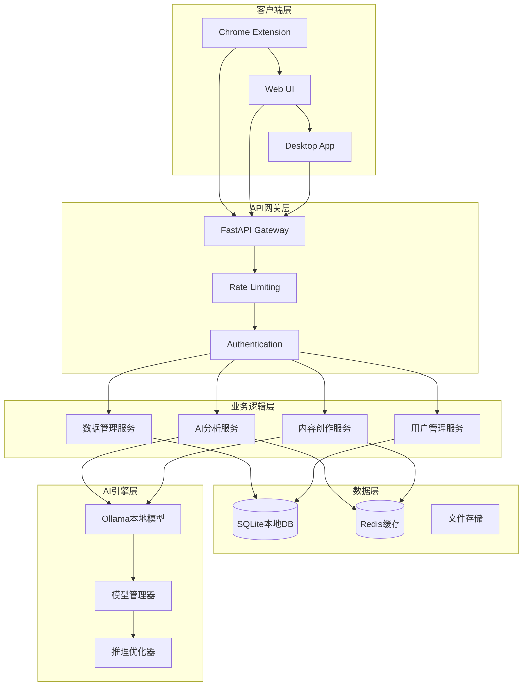

# 🔧 技术架构与产品规划

## 📋 技术架构概述

**智能浏览助手**采用**"本地化AI + 云端协作"**的混合架构，确保用户数据隐私的同时提供强大的AI分析能力。核心技术栈基于现代Web技术、本地大模型和分布式系统设计。

---

## 🏗️ 整体技术架构

### 1. 架构设计原则

#### 1.1 核心设计理念
- **隐私至上**: 敏感数据100%本地处理，零上传
- **性能优先**: 毫秒级响应，流畅用户体验
- **可扩展性**: 模块化设计，支持功能快速迭代
- **高可用性**: 99.9%+可用性，故障自恢复

#### 1.2 技术选型原则
```
前端技术栈:
├── 渐进增强 (Progressive Enhancement)
├── 响应式设计 (Responsive Design)
├── 组件化架构 (Component-Based)
└── 性能优化优先 (Performance First)

后端技术栈:
├── 微服务架构 (Microservices)
├── 异步处理 (Async Processing)
├── 容器化部署 (Containerization)
└── 自动化运维 (DevOps)
```

### 2. 系统架构图



---

## 💻 技术栈详解

### 1. 前端技术架构

#### 1.1 Chrome扩展 (Extension)
```typescript
技术栈:
├── Manifest V3 (最新扩展标准)
├── TypeScript (类型安全)
├── Webpack (模块打包)
├── Tailwind CSS (样式框架)
└── Chrome APIs (浏览器接口)

关键模块:
├── Background Service Worker
├── Content Scripts
├── Popup Interface
├── Options Page
└── Data Sync Engine
```

#### 1.2 Web管理界面
```typescript
技术栈:
├── HTML5 + ES6+ (现代Web标准)
├── Tailwind CSS (响应式设计)
├── Alpine.js/Vanilla JS (轻量级交互)
├── Chart.js (数据可视化)
└── PWA (渐进式Web应用)

组件架构:
├── 仪表板组件 (Dashboard)
├── 数据表格组件 (DataTable)
├── 图表可视化组件 (Charts)
├── AI助手界面 (AI Hub)
└── 设置配置组件 (Settings)
```

#### 1.3 移动端适配 (未来)
```typescript
技术方案:
├── React Native (跨平台)
├── Flutter (高性能UI)
├── Capacitor (Web转原生)
└── PWA (渐进式Web应用)

功能适配:
├── 移动端浏览记录同步
├── 触控优化的AI助手
├── 离线数据分析
└── 推送通知集成
```

### 2. 后端技术架构

#### 2.1 API服务层
```python
FastAPI框架:
├── 异步编程支持 (async/await)
├── 自动API文档生成 (OpenAPI)
├── 数据验证 (Pydantic)
├── 高性能路由 (Starlette)
└── WebSocket支持 (实时通信)

核心服务:
├── 用户认证服务 (Auth Service)
├── 数据同步服务 (Sync Service)
├── AI分析服务 (Analysis Service)
├── 内容创作服务 (Creation Service)
└── 文件管理服务 (File Service)
```

#### 2.2 数据处理层
```python
数据管道:
原始数据 → 清洗验证 → 结构化存储 → 分析处理 → 结果输出

处理组件:
├── 数据验证器 (Data Validator)
├── 增量同步器 (Incremental Syncer)
├── 数据聚合器 (Data Aggregator)
├── 缓存管理器 (Cache Manager)
└── 备份恢复器 (Backup Manager)
```

#### 2.3 AI集成层
```python
AI服务架构:
├── 模型管理 (Model Management)
├── 推理引擎 (Inference Engine)
├── 结果缓存 (Result Caching)
├── 质量评估 (Quality Assessment)
└── 错误处理 (Error Handling)

支持的AI模型:
├── Ollama本地模型 (主要)
├── OpenAI API (备选)
├── Anthropic Claude (备选)
└── 自定义模型 (扩展)
```

### 3. 数据存储架构

#### 3.1 本地数据库设计
```sql
-- 核心表结构
CREATE TABLE browser_history (
    id INTEGER PRIMARY KEY,
    url TEXT NOT NULL,
    title TEXT,
    visit_time TIMESTAMP,
    visit_count INTEGER DEFAULT 1,
    favicon_url TEXT,
    created_at TIMESTAMP DEFAULT CURRENT_TIMESTAMP,
    updated_at TIMESTAMP DEFAULT CURRENT_TIMESTAMP
);

CREATE TABLE ai_configs (
    id INTEGER PRIMARY KEY,
    name TEXT UNIQUE NOT NULL,
    type TEXT NOT NULL,
    base_url TEXT,
    model TEXT NOT NULL,
    max_tokens INTEGER DEFAULT 2048,
    temperature REAL DEFAULT 0.7,
    is_active BOOLEAN DEFAULT 1,
    created_at TIMESTAMP DEFAULT CURRENT_TIMESTAMP
);

CREATE TABLE analysis_results (
    id INTEGER PRIMARY KEY,
    analysis_type TEXT NOT NULL,
    input_data_hash TEXT,
    result_data TEXT,
    confidence_score REAL,
    created_at TIMESTAMP DEFAULT CURRENT_TIMESTAMP
);
```

#### 3.2 数据模型设计
```python
# Pydantic数据模型
class HistoryItem(BaseModel):
    """浏览历史条目"""
    url: str
    title: Optional[str] = None
    visitTime: datetime
    visitCount: int = 1
    
    @field_validator('url')
    def validate_url(cls, v):
        # URL格式验证
        return validate_and_normalize_url(v)

class AIAnalysisResult(BaseModel):
    """AI分析结果"""
    analysis_type: str
    user_profile: Dict[str, Any]
    interest_tags: List[str]
    behavior_insights: Dict[str, Any]
    recommendations: List[str]
    confidence: float
```

#### 3.3 缓存策略
```python
缓存层次:
├── L1: 内存缓存 (应用层)
├── L2: Redis缓存 (分布式)
├── L3: 磁盘缓存 (持久化)
└── L4: CDN缓存 (静态资源)

缓存策略:
├── 热点数据缓存 (频繁访问)
├── AI结果缓存 (计算密集)
├── 用户会话缓存 (状态保持)
└── 配置信息缓存 (系统设置)
```

---

## 🤖 AI技术架构

### 1. 本地AI引擎

#### 1.1 Ollama集成架构
```python
class OllamaManager:
    """Ollama模型管理器"""
    
    def __init__(self):
        self.base_url = "http://localhost:11434"
        self.models = {}
        self.load_balancer = LoadBalancer()
    
    async def generate(self, prompt: str, model: str) -> str:
        """AI文本生成"""
        try:
            response = await self.client.post(
                f"{self.base_url}/api/generate",
                json={
                    "model": model,
                    "prompt": prompt,
                    "stream": False,
                    "options": {
                        "temperature": 0.7,
                        "max_tokens": 2048
                    }
                }
            )
            return self.parse_response(response)
        except Exception as e:
            return await self.fallback_generation(prompt, model)
```

#### 1.2 AI功能模块
```python
AI能力模块:
├── 文本分析模块 (Text Analysis)
│   ├── 关键词提取
│   ├── 情感分析
│   ├── 主题分类
│   └── 摘要生成
├── 行为分析模块 (Behavior Analysis)
│   ├── 访问模式识别
│   ├── 兴趣偏好分析
│   ├── 时间规律发现
│   └── 异常行为检测
├── 内容创作模块 (Content Creation)
│   ├── 文案生成
│   ├── 标题优化
│   ├── SEO优化
│   └── 多风格适配
└── 推荐系统模块 (Recommendation)
    ├── 个性化推荐
    ├── 内容发现
    ├── 趋势预测
    └── 相似用户匹配
```

### 2. AI性能优化

#### 2.1 推理加速
```python
优化策略:
├── 模型量化 (Model Quantization)
├── 批处理优化 (Batch Processing)
├── 缓存机制 (Result Caching)
├── 异步处理 (Async Processing)
└── 硬件加速 (GPU/TPU)

性能目标:
├── 简单分析: <5秒
├── 深度分析: <30秒
├── 内容创作: <60秒
└── 批量处理: <5分钟
```

#### 2.2 质量保证
```python
质量控制:
├── 输入验证 (Input Validation)
├── 输出检查 (Output Verification)
├── 一致性测试 (Consistency Testing)
├── 用户反馈收集 (Feedback Collection)
└── 持续优化 (Continuous Improvement)

评估指标:
├── 准确性 (Accuracy)
├── 相关性 (Relevance)
├── 一致性 (Consistency)
├── 响应时间 (Response Time)
└── 用户满意度 (User Satisfaction)
```

---

## 📱 产品功能规划

### 1. 核心功能模块

#### 1.1 浏览记录管理
```
当前版本功能:
├── ✅ 历史记录分页显示
├── ✅ 搜索和过滤
├── ✅ 批量导出 (CSV/JSON)
├── ✅ 增量同步
└── ✅ 数据统计分析

下一版本规划:
├── 🔄 智能分类标签
├── 🔄 收藏夹管理
├── 🔄 访问时长统计
├── 🔄 网站截图缓存
└── 🔄 历史记录备份恢复
```

#### 1.2 AI分析功能
```
当前版本功能:
├── ✅ 用户画像分析
├── ✅ 兴趣标签提取
├── ✅ 行为模式识别
├── ✅ 个性化建议
└── ✅ 分析报告生成

下一版本规划:
├── 🔄 趋势预测分析
├── 🔄 异常行为检测
├── 🔄 时间序列分析
├── 🔄 群体对比分析
└── 🔄 智能洞察推送
```

#### 1.3 内容创作助手
```
当前版本功能:
├── ✅ 网页内容分析
├── ✅ 多风格文案生成
├── ✅ 标题优化建议
├── ✅ SEO关键词提取
└── ✅ 一键复制导出

下一版本规划:
├── 🔄 模板库管理
├── 🔄 批量内容生成
├── 🔄 多语言支持
├── 🔄 图片内容理解
└── 🔄 视频脚本生成
```

### 2. 产品发展路线图

#### 2.1 短期规划 (3-6个月)
```
Version 1.1 - 功能完善版
├── 用户体验优化
├── 性能问题修复
├── 新功能开发
├── 多平台适配
└── 安全性增强

主要特性:
├── 智能分类系统
├── 高级分析报告
├── 团队协作功能
├── 移动端支持
└── 企业级安全
```

#### 2.2 中期规划 (6-12个月)
```
Version 2.0 - 平台化版本
├── 开放API平台
├── 插件生态系统
├── 第三方集成
├── 高级AI功能
└── 国际化支持

核心能力:
├── 开发者生态
├── 企业级功能
├── 多语言支持
├── 云端同步
└── 高级分析
```

#### 2.3 长期规划 (12个月+)
```
Version 3.0 - 生态平台
├── 多产品矩阵
├── AI能力输出
├── 行业解决方案
├── 智能化升级
└── 全球化部署

愿景目标:
├── 个人助手平台
├── 企业智能平台
├── 开发者工具平台
├── 数据服务平台
└── AI技术平台
```

### 3. 技术债务管理

#### 3.1 当前技术债务
```
代码质量:
├── 测试覆盖率提升 (目标80%+)
├── 代码重构优化
├── 文档完善更新
├── 代码规范统一
└── 性能优化改进

架构优化:
├── 微服务拆分
├── 缓存策略优化
├── 数据库性能调优
├── API版本管理
└── 监控告警完善
```

#### 3.2 技术栈演进
```
前端技术升级:
├── 组件化重构
├── 状态管理优化
├── 构建工具升级
├── 测试框架引入
└── 性能监控集成

后端技术升级:
├── 异步框架优化
├── 数据库迁移升级
├── 缓存系统重构
├── 安全框架加强
└── 监控体系完善
```

---

## 🔒 安全架构设计

### 1. 数据安全保护

#### 1.1 本地数据加密
```python
加密策略:
├── 数据库文件加密 (AES-256)
├── 配置文件加密
├── 临时文件安全清理
├── 内存数据保护
└── 传输过程加密

实施方案:
class DataEncryption:
    def __init__(self, key: bytes):
        self.cipher = AES.new(key, AES.MODE_GCM)
    
    def encrypt_data(self, data: str) -> bytes:
        """数据加密"""
        nonce = self.cipher.nonce
        ciphertext, tag = self.cipher.encrypt_and_digest(data.encode())
        return nonce + tag + ciphertext
    
    def decrypt_data(self, encrypted_data: bytes) -> str:
        """数据解密"""
        nonce = encrypted_data[:16]
        tag = encrypted_data[16:32]
        ciphertext = encrypted_data[32:]
        cipher = AES.new(self.key, AES.MODE_GCM, nonce=nonce)
        data = cipher.decrypt_and_verify(ciphertext, tag)
        return data.decode()
```

#### 1.2 访问控制
```python
权限管理:
├── 用户身份认证 (JWT Token)
├── API访问限制 (Rate Limiting)
├── 功能权限控制 (RBAC)
├── 数据访问审计 (Audit Log)
└── 异常行为监控 (Anomaly Detection)

安全中间件:
class SecurityMiddleware:
    async def __call__(self, request, call_next):
        # 请求验证
        if not self.validate_request(request):
            return JSONResponse(
                status_code=403,
                content={"error": "Access denied"}
            )
        
        # 执行请求
        response = await call_next(request)
        
        # 响应加密
        return self.encrypt_response(response)
```

### 2. 网络安全防护

#### 2.1 API安全
```python
安全措施:
├── HTTPS强制加密
├── API密钥认证
├── 请求签名验证
├── 跨域保护 (CORS)
└── 输入验证过滤

实施代码:
@app.middleware("http")
async def security_middleware(request: Request, call_next):
    # 强制HTTPS
    if not request.url.scheme == "https" and not request.client.host == "localhost":
        return RedirectResponse(
            url=str(request.url).replace("http://", "https://")
        )
    
    # 安全头设置
    response = await call_next(request)
    response.headers["X-Content-Type-Options"] = "nosniff"
    response.headers["X-Frame-Options"] = "DENY"
    response.headers["X-XSS-Protection"] = "1; mode=block"
    return response
```

#### 2.2 隐私保护合规
```python
隐私保护措施:
├── 数据最小化原则
├── 用户同意机制
├── 数据删除权利
├── 数据导出功能
└── 透明度报告

GDPR合规:
class PrivacyManager:
    def __init__(self):
        self.consent_manager = ConsentManager()
        self.data_processor = DataProcessor()
    
    def process_user_data(self, user_id: str, data: dict):
        """处理用户数据"""
        # 检查用户同意
        if not self.consent_manager.has_consent(user_id, "data_processing"):
            raise PermissionError("User consent required")
        
        # 数据最小化处理
        minimal_data = self.data_processor.minimize(data)
        return self.process_minimal_data(minimal_data)
```

---

## 📊 监控运维架构

### 1. 系统监控体系

#### 1.1 性能监控
```python
监控指标:
├── 系统资源 (CPU, Memory, Disk)
├── 应用性能 (Response Time, Throughput)
├── 数据库性能 (Query Time, Connection Pool)
├── AI推理性能 (Inference Time, GPU Usage)
└── 用户体验 (Page Load Time, Error Rate)

监控实现:
class PerformanceMonitor:
    def __init__(self):
        self.metrics_collector = MetricsCollector()
        self.alert_manager = AlertManager()
    
    @monitor_performance
    async def track_api_performance(self, endpoint: str):
        """API性能监控"""
        start_time = time.time()
        try:
            yield
        finally:
            duration = time.time() - start_time
            self.metrics_collector.record_metric(
                name=f"api_duration_{endpoint}",
                value=duration,
                labels={"endpoint": endpoint}
            )
```

#### 1.2 日志管理
```python
日志架构:
├── 结构化日志 (JSON Format)
├── 日志等级管理 (DEBUG/INFO/WARN/ERROR)
├── 日志聚合分析 (ELK Stack)
├── 敏感信息过滤
└── 日志备份归档

日志配置:
import logging
import json

class StructuredLogger:
    def __init__(self, name: str):
        self.logger = logging.getLogger(name)
        handler = logging.StreamHandler()
        handler.setFormatter(JSONFormatter())
        self.logger.addHandler(handler)
    
    def log_event(self, level: str, message: str, **kwargs):
        """结构化日志记录"""
        log_data = {
            "timestamp": datetime.utcnow().isoformat(),
            "level": level,
            "message": message,
            "metadata": kwargs
        }
        getattr(self.logger, level.lower())(json.dumps(log_data))
```

### 2. 故障处理机制

#### 2.1 故障检测
```python
检测机制:
├── 健康检查 (Health Check)
├── 异常监控 (Exception Monitoring)
├── 性能阈值 (Performance Threshold)
├── 用户反馈 (User Feedback)
└── 自动化测试 (Automated Testing)

健康检查:
@app.get("/health")
async def health_check():
    """系统健康检查"""
    checks = {
        "database": await check_database_health(),
        "ai_service": await check_ai_service_health(),
        "cache": await check_cache_health(),
        "storage": await check_storage_health()
    }
    
    overall_status = "healthy" if all(checks.values()) else "unhealthy"
    
    return {
        "status": overall_status,
        "timestamp": datetime.utcnow().isoformat(),
        "checks": checks
    }
```

#### 2.2 自动恢复
```python
恢复策略:
├── 服务重启 (Service Restart)
├── 故障转移 (Failover)
├── 降级服务 (Service Degradation)
├── 资源扩容 (Auto Scaling)
└── 备份恢复 (Backup Recovery)

自动恢复:
class AutoRecovery:
    def __init__(self):
        self.recovery_strategies = {
            "service_down": self.restart_service,
            "high_memory": self.scale_resources,
            "database_error": self.switch_to_backup,
            "ai_timeout": self.enable_fallback_mode
        }
    
    async def handle_failure(self, failure_type: str, context: dict):
        """故障自动处理"""
        if strategy := self.recovery_strategies.get(failure_type):
            try:
                await strategy(context)
                self.log_recovery_success(failure_type, context)
            except Exception as e:
                self.escalate_to_human(failure_type, context, str(e))
```

---

## 🎯 技术发展规划

### 1. 短期技术目标 (3-6个月)

#### 1.1 性能优化
```
优化目标:
├── API响应时间 < 100ms (95th percentile)
├── AI分析时间 < 10s (常规分析)
├── 内容创作时间 < 30s (标准长度)
├── 数据同步效率提升50%
└── 内存使用优化30%

实施计划:
├── 数据库查询优化
├── 缓存策略改进
├── AI模型优化
├── 前端性能调优
└── 网络传输优化
```

#### 1.2 功能扩展
```
新功能开发:
├── 多浏览器支持 (Firefox, Safari, Edge)
├── 移动端Web界面
├── 团队协作功能
├── 高级分析报告
└── API开放平台
```

### 2. 中期技术规划 (6-18个月)

#### 2.1 架构升级
```
架构演进:
├── 微服务架构重构
├── 容器化部署
├── 云原生架构
├── 服务网格集成
└── 边缘计算支持

技术栈升级:
├── 数据库升级 (PostgreSQL)
├── 缓存系统 (Redis Cluster)
├── 消息队列 (RabbitMQ/Kafka)
├── 搜索引擎 (Elasticsearch)
└── 监控系统 (Prometheus/Grafana)
```

#### 2.2 AI能力提升
```
AI技术发展:
├── 多模态AI支持
├── 实时推理优化
├── 模型个性化训练
├── 联邦学习探索
└── AI安全防护

应用场景扩展:
├── 语音交互支持
├── 图像内容理解
├── 视频分析能力
├── 知识图谱构建
└── 预测分析能力
```

### 3. 长期技术愿景 (18个月+)

#### 3.1 平台化发展
```
平台能力:
├── 开发者生态平台
├── AI能力开放平台
├── 数据服务平台
├── 行业解决方案平台
└── 全球化技术平台

技术标准:
├── 隐私计算标准制定
├── AI安全标准参与
├── 数据互操作标准
├── 开源项目贡献
└── 行业标准影响
```

#### 3.2 创新技术探索
```
前沿技术:
├── 量子计算应用
├── 区块链技术集成
├── AR/VR界面探索
├── 脑机接口研究
└── 6G网络应用

研发投入:
├── 核心技术专利申请
├── 前沿技术研究
├── 学术合作项目
├── 开源社区贡献
└── 人才培养计划
```

---

## 📈 技术团队规划

### 1. 团队结构设计

#### 1.1 核心技术团队
```
技术管理层:
├── CTO (首席技术官)
├── 架构师 (System Architect)
├── 技术总监 (Tech Director)
└── 产品技术负责人 (Tech Lead)

开发团队:
├── 前端开发团队 (3-5人)
├── 后端开发团队 (4-6人)
├── AI算法团队 (2-3人)
├── DevOps运维团队 (2-3人)
└── 测试质量团队 (2-3人)
```

#### 1.2 技能要求矩阵
```
前端团队技能:
├── JavaScript/TypeScript精通
├── 现代前端框架经验
├── 浏览器扩展开发
├── 移动端开发经验
└── UI/UX设计理解

后端团队技能:
├── Python/FastAPI精通
├── 数据库设计优化
├── 分布式系统经验
├── API设计最佳实践
└── 微服务架构经验

AI团队技能:
├── 机器学习算法
├── 深度学习框架
├── NLP技术应用
├── 模型优化调优
└── AI工程实践
```

### 2. 技术文化建设

#### 2.1 开发流程规范
```
开发规范:
├── 代码审查制度 (Code Review)
├── 测试驱动开发 (TDD)
├── 持续集成部署 (CI/CD)
├── 文档驱动开发 (Documentation First)
└── 安全开发生命周期 (SDLC)

质量保证:
├── 代码质量门禁
├── 自动化测试覆盖
├── 性能测试基准
├── 安全扫描检查
└── 用户体验测试
```

#### 2.2 技术成长体系
```
成长路径:
├── 初级工程师 → 中级工程师 → 高级工程师 → 专家工程师
├── 技术专家路径 (Technical Expert)
├── 管理路径 (Engineering Manager)
├── 架构师路径 (Architect)
└── 技术创新路径 (Tech Innovation)

培养机制:
├── 内部技术分享
├── 外部培训课程
├── 开源项目参与
├── 技术会议参加
└── 导师制度建立
```

---

## 🎯 总结与展望

### 技术架构优势
1. **隐私优先的设计**: 本地化AI处理确保用户数据安全
2. **现代化的技术栈**: 采用最新的Web技术和AI框架
3. **可扩展的架构**: 模块化设计支持快速功能迭代
4. **高性能的实现**: 优化的数据处理和AI推理性能

### 产品规划亮点
1. **用户体验至上**: 从简单易用到功能强大的渐进式设计
2. **AI能力领先**: 本地化AI处理在隐私保护上的独特优势
3. **生态化发展**: 从单一产品到开放平台的演进路径
4. **国际化视野**: 支持全球化部署和本地化适配

### 技术发展展望
随着AI技术的快速发展和用户对隐私保护需求的增强，智能浏览助手的技术架构将持续演进。我们将保持技术领先性，同时确保产品的稳定性和用户体验，最终建设成为个人AI助手领域的技术标杆。

未来3-5年内，我们计划将技术能力开放为平台服务，为更多开发者和企业提供隐私保护的AI能力，推动整个行业向更加安全、智能的方向发展。

---

*本文档为技术团队的指导性文件，需根据技术发展和业务需求持续更新*  
*最后更新: 2025年8月9日*  
*版本: v1.0*