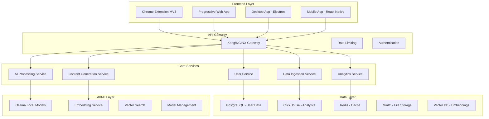

# 🚀 AI-Favorite-Company 专业级产品重设计方案

## 📋 执行摘要

**产品现状分析**：
- 现有产品是一个基于本地AI的浏览行为分析与内容创作平台
- 技术栈：FastAPI + SQLite + Chrome Extension (Manifest V3) + Vanilla JS
- 核心功能：浏览记录分析、AI内容生成、数据可视化

**重设计目标**：将产品从概念验证阶段提升到企业级专业产品，具备可扩展性、高性能和现代化用户体验。

## 🎯 产品重新定位

### 新产品愿景
**"AI-Powered Personal Intelligence Platform"** - 将个人数字足迹转化为可操作的智能洞察和内容资产的综合平台。

### 目标用户群体
1. **内容创作者** - 博主、YouTuber、社交媒体创作者
2. **知识工作者** - 研究员、分析师、咨询师
3. **企业用户** - 市场营销团队、商业智能分析师
4. **个人用户** - 注重隐私和个人数据管理的技术爱好者

## 🏗️ 系统架构重设计

### 1. 现代化微服务架构



### 2. 技术栈升级

#### 后端架构
- **API层**: FastAPI + Pydantic V2 + SQLAlchemy 2.0
- **服务编排**: Docker + Kubernetes
- **数据库**: 
  - 主数据库：PostgreSQL 15+
  - 分析数据库：ClickHouse
  - 缓存：Redis 7.0
  - 向量数据库：Qdrant/Chroma
- **消息队列**: Apache Kafka + Redis Streams
- **AI/ML**: 
  - 本地模型：Ollama + Llama 3.2/Qwen 2.5
  - 嵌入模型：sentence-transformers
  - 向量搜索：FAISS/Qdrant

#### 前端架构
- **Chrome扩展**: Manifest V3 + TypeScript + Vite
- **Web应用**: Next.js 14 + TypeScript + Tailwind CSS
- **状态管理**: Zustand + React Query
- **组件库**: Shadcn/ui + Radix UI
- **可视化**: D3.js + Recharts + Observable Plot

#### DevOps & 基础设施
- **容器化**: Docker + Docker Compose
- **编排**: Kubernetes (k3s for local development)
- **CI/CD**: GitHub Actions + ArgoCD
- **监控**: Prometheus + Grafana + Jaeger
- **日志**: ELK Stack (Elasticsearch + Logstash + Kibana)

## 🎨 用户体验重设计

### 1. 设计系统

#### 视觉语言
- **设计风格**: Modern Minimalism + Dark Mode优先
- **颜色系统**: 
  - 主色调：Deep Blue (#1E40AF) + Electric Purple (#8B5CF6)
  - 渐变效果：动态渐变背景
  - 暗色模式：True Black (#000000) + Dark Gray (#0F172A)
- **字体系统**: 
  - 英文：Inter Variable
  - 中文：苹方/PingFang SC
  - 代码：JetBrains Mono

#### 设计趋势应用
1. **Glassmorphism效果** - 半透明卡片和面板
2. **Neumorphism细节** - 关键交互元素的微妙阴影
3. **动态微交互** - Framer Motion驱动的流畅动画
4. **自适应布局** - 响应式网格系统
5. **AI生成图标** - 动态生成的可视化元素

### 2. 界面重新设计

#### Chrome扩展界面
```
┌─────────────────────────────────┐
│ ⚡ AI Intelligence Hub    ⚙️📊│
├─────────────────────────────────┤
│ 📈 Real-time Insights           │
│ • 5 articles analyzed today     │
│ • 3 content pieces generated    │
│ • 12 keywords trending ↗️       │
├─────────────────────────────────┤
│ 🤖 Quick Actions               │
│ [📝 Generate Summary]          │
│ [🔍 Extract Insights]          │
│ [📋 Save to Collection]        │
├─────────────────────────────────┤
│ 🎯 Smart Suggestions           │
│ "Based on your reading, you     │
│  might be interested in..."     │
└─────────────────────────────────┘
```

#### 主Web应用界面
```
┌─────────────────────────────────────────────────────────┐
│ 🎯 Dashboard                          🔍[Search] 👤[User]│
├─────────────────────────────────────────────────────────┤
│ 📊 Intelligence Overview                                │
│ ┌─────────┐ ┌─────────┐ ┌─────────┐ ┌─────────┐       │
│ │ 1.2k    │ │ 47      │ │ 89%     │ │ 23      │       │
│ │Articles │ │Contents │ │Accuracy │ │Collections│     │
│ └─────────┘ └─────────┘ └─────────┘ └─────────┘       │
├─────────────────────────────────────────────────────────┤
│ 🧠 AI Workspace                    📈 Analytics        │
│ ┌─────────────────────┐           ┌─────────────────┐  │
│ │ 🤖 Content Generator │           │ 📊 Trend Analysis│  │
│ │ [Topic] [Style] [Generate] │     │ [Interactive    │  │
│ │ Recent: "AI Trends" │           │  Charts Here]   │  │
│ └─────────────────────┘           └─────────────────┘  │
├─────────────────────────────────────────────────────────┤
│ 📚 Knowledge Graph                 🔥 Trending Topics  │
│ [Interactive Network Visualization] [Real-time Feed]   │
└─────────────────────────────────────────────────────────┘
```

## 💡 核心功能模块重设计

### 1. 智能数据采集引擎

#### 功能特性
- **实时采集**: 浏览行为、内容交互、时间模式
- **隐私保护**: 端到端加密、本地处理优先
- **多源集成**: 浏览器、文档、社交媒体API
- **智能过滤**: 基于ML的内容质量评估

#### 技术实现
```python
# 新的数据采集架构
class DataIngestionEngine:
    def __init__(self):
        self.collectors = [
            BrowserActivityCollector(),
            ContentAnalysisCollector(),
            UserInteractionCollector(),
        ]
        self.processors = [
            PrivacyFilter(),
            QualityScorer(),
            CategoryClassifier(),
        ]
        self.storage = VectorizedStorage()
    
    async def process_event(self, event: UserEvent):
        # 隐私过滤 + 质量评估 + 向量化存储
        filtered_event = await self.apply_privacy_filters(event)
        enriched_event = await self.enrich_with_ai(filtered_event)
        await self.storage.store_vectorized(enriched_event)
```

### 2. AI驱动的内容智能

#### 增强功能
1. **智能摘要生成** - 多层次摘要（关键词、要点、深度分析）
2. **内容风格适配** - 根据目标受众自动调整语调和风格
3. **多模态内容生成** - 文本 + 图表 + 思维导图
4. **实时协作编辑** - 类似Notion的协作体验
5. **版本控制** - Git风格的内容版本管理

#### AI模型集成
```python
class ContentIntelligenceEngine:
    def __init__(self):
        self.local_llm = OllamaClient(model="llama3.2:70b")
        self.embedding_model = SentenceTransformer("all-MiniLM-L6-v2")
        self.vector_store = QdrantClient()
        
    async def generate_content(self, prompt: str, style: ContentStyle):
        # 检索相关上下文
        context = await self.retrieve_context(prompt)
        
        # 生成内容
        content = await self.local_llm.generate(
            prompt=prompt,
            context=context,
            style=style,
            temperature=0.7
        )
        
        # 质量评估和优化
        optimized_content = await self.optimize_content(content)
        return optimized_content
```

### 3. 高级分析仪表板

#### 可视化升级
1. **交互式图表** - D3.js + Observable Plot
2. **实时数据流** - WebSocket连接的实时更新
3. **个性化视图** - 基于用户偏好的自定义布局
4. **预测性分析** - 趋势预测和模式识别
5. **协作分享** - 一键分享分析报告

#### 分析维度
- **内容消费模式**: 阅读时间、主题偏好、深度分析
- **创作效率指标**: 生成速度、质量评分、使用频率
- **知识图谱**: 概念关联、学习路径、知识缺口
- **趋势预测**: 兴趣发展、内容需求、市场机会

## 🔒 安全与隐私加强

### 1. 零信任安全架构

#### 安全策略
- **端到端加密**: 所有数据传输使用TLS 1.3
- **本地优先**: 敏感数据本地处理，云端仅存储加密元数据
- **访问控制**: JWT + OAuth 2.0 + RBAC
- **数据最小化**: 只收集必要数据，定期清理过期数据

#### 隐私保护
```python
class PrivacyEngine:
    def __init__(self):
        self.encryption = AESEncryption(key_size=256)
        self.anonymizer = DataAnonymizer()
        self.consent_manager = ConsentManager()
    
    async def process_sensitive_data(self, data: UserData):
        # 检查用户同意
        if not await self.consent_manager.has_consent(data.user_id, data.type):
            raise PrivacyError("User consent required")
        
        # 数据匿名化
        anonymized = await self.anonymizer.anonymize(data)
        
        # 加密存储
        encrypted = await self.encryption.encrypt(anonymized)
        return encrypted
```

## 📱 跨平台扩展

### 1. 多端应用生态

#### Chrome扩展增强
- **Manifest V3完全兼容**
- **AI功能集成** - 内置Chrome AI APIs
- **离线工作模式** - Service Worker缓存
- **跨设备同步** - 云端状态同步

#### PWA Web应用
- **原生应用体验** - 安装到桌面
- **离线功能** - 缓存策略优化
- **推送通知** - 重要洞察提醒
- **响应式设计** - 完美适配所有设备

#### 桌面应用 (Electron)
- **系统集成** - 原生文件系统访问
- **全局快捷键** - 快速启动AI功能
- **后台运行** - 持续数据采集
- **本地AI模型** - 完全离线运行

### 2. API优先设计

#### RESTful API v2
```yaml
# API设计示例
/api/v2/
├── /users
│   ├── GET /profile
│   ├── PUT /preferences
│   └── POST /sync
├── /analytics
│   ├── GET /dashboard
│   ├── GET /trends
│   └── POST /custom-query
├── /content
│   ├── POST /generate
│   ├── GET /history
│   └── PUT /{id}/optimize
└── /ai
    ├── POST /analyze
    ├── POST /summarize
    └── GET /models/status
```

## 🚀 实施路线图

### Phase 1: 基础架构重构 (3个月)
1. **月1**: 微服务架构设计 + 数据库迁移
2. **月2**: API重构 + 认证系统升级
3. **月3**: Chrome扩展Manifest V3迁移

### Phase 2: 核心功能升级 (3个月)
1. **月4**: AI引擎重构 + 向量数据库集成
2. **月5**: 新UI/UX实现 + 组件库建设
3. **月6**: 高级分析功能 + 实时数据流

### Phase 3: 平台扩展 (3个月)
1. **月7**: PWA开发 + 离线功能
2. **月8**: 桌面应用 + 移动端原型
3. **月9**: 企业功能 + 团队协作

### Phase 4: 生态完善 (3个月)
1. **月10**: API开放平台 + 开发者工具
2. **月11**: 高级AI功能 + 自定义模型
3. **月12**: 商业化功能 + 企业部署方案

## 💰 商业模式设计

### 1. 订阅层级

#### 个人版 (Freemium)
- 基础浏览分析
- 月度10篇AI生成内容
- 标准模板和风格

#### 专业版 ($19/月)
- 无限AI内容生成
- 高级分析洞察
- 自定义模板
- 优先级支持

#### 企业版 ($99/月/团队)
- 团队协作功能
- 企业级安全
- API访问
- 专属客户经理

### 2. 增值服务
- **定制化AI模型训练** - $299一次性
- **企业私有部署** - $5,000起
- **API调用包** - $0.01/调用
- **专业咨询服务** - $200/小时

## 📊 成功指标与KPI

### 用户增长指标
- **月活用户 (MAU)**: 目标50,000用户/年
- **用户留存率**: 7天留存 > 40%, 30天留存 > 25%
- **病毒系数**: K值 > 1.2

### 产品使用指标
- **AI内容生成**: 平均每用户每月20篇
- **分析查看**: 每用户每周3次仪表板访问
- **功能使用深度**: 80%用户使用3+核心功能

### 商业指标
- **年度经常性收入 (ARR)**: $500,000
- **客户获取成本 (CAC)**: < $50
- **客户生命周期价值 (LTV)**: > $500
- **LTV/CAC比率**: > 10:1

## 🎯 总结

这份重设计方案基于2025年最新的技术趋势和设计理念，将帮助产品从概念验证阶段提升到企业级专业产品。通过现代化的架构、先进的AI能力和出色的用户体验，产品将能够在竞争激烈的市场中脱颖而出。

关键成功因素：
1. 严格按照路线图执行
2. 持续收集用户反馈并快速迭代
3. 保持技术栈的先进性
4. 注重数据安全和用户隐私
5. 建立可持续的商业模式